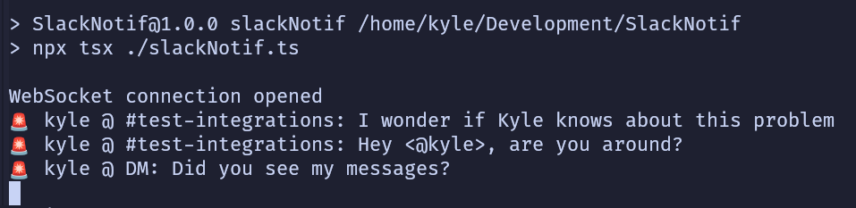

# SlackNotif

## Because keeping slack open all of time time sucks

SlackNotif is a simple node script to let you receive notifications from slack without keeping slack open.
Most people probably don't have this problem because they're ok with having slack on their phone, but
I find that leads to me checking it all hours of the day.

## Usage

1. `pnpm install`
2. Open your slack workspace in a browser with your devtools open, use the network tab to get the `token` and `cookie` values it connects with.
3. Place these values into a `.env` file with the format of `API_TOKEN=` and `COOKIE=`
4. `pnpm slackNotif`
